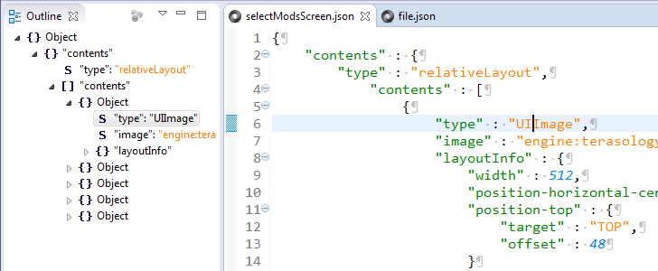

Eclipse Json Editor Plugin
=======================

This plugin adds support for JSON files to eclipse. You can install the latest version either through the eclipse Marketplace or directly from this update site:

http://boothen.github.io/Json-Eclipse-Plugin/

Features
---------------------

* Supports every eclipse flavor (JavaEE, CDT, RCP, you name it!)
* Supports eclipse version 3.7 - 4.5.2 and most probably later versions
* Deep Integration (File wizards, outline page, preferences)
* Quick Outline with reg-ex support `(CTRL + O)`
* Highly configurable code formatting `(CTRL + SHIFT + F)`
* Custom syntax highlighting
* Detects duplicate keys
* Reliable, resilient and fast syntax tree lexing and parsing through ANTLR 4
* Available for free - that's a feature, isn't it?

License
---------------------
This software is licensed in compliance with the eclipse Foundation under the 

SourceForge
---------------------

This plugin was formerly hosted at https://sourceforge.net/projects/eclipsejsonedit/

