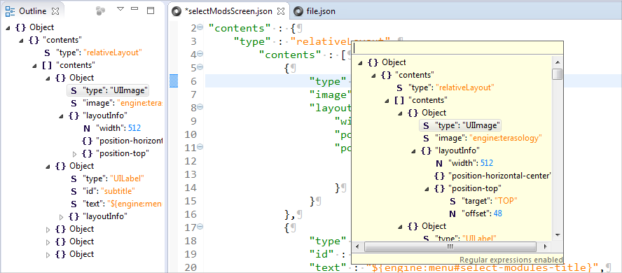

Eclipse Json Editor Plugin
=======================

This plugin adds support for JSON files to eclipse. You can install the latest version directly from this update site:

    http://boothen.github.io/Json-Eclipse-Plugin/

You can also get this plugin from the [eclipse Marketplace](https://marketplace.eclipse.org/content/json-editor-plugin).

A small video demonstration is [available on YouTube](https://www.youtube.com/watch?v=vXRwFwk2QE4) 

Features
---------------------

* Supports every eclipse flavor (JavaEE, CDT, RCP, you name it!)
* Supports eclipse version 3.7 - 4.8.0 and most probably later versions
* Conforms to the JSON standard as defined in the [RFC 4627](https://tools.ietf.org/html/rfc4627) by D. Crockford
* Deep Integration (File wizards, tree outline, preference pages)
* Quick Outline with reg-ex support `(CTRL + O)`
* Highly configurable code formatting `(CTRL + SHIFT + F)`
* Custom syntax highlighting
* Text folding and range highlighters
* Detects duplicate keys
* Reliable, resilient and fast syntax tree parsing and validation through ANTLR 4
* Synchronized tree view and text editor
* Available for free - that's a feature, isn't it?

Developer Guides
---------------------
See this [getting started page](developer-guide.md) or the [release management cheat sheet](release-process.md).

License
---------------------
This software is licensed in compliance with the eclipse Foundation under the [eclipse Public License 1.0](https://www.eclipse.org/legal/epl-v10.html).

SourceForge
---------------------

This plugin was formerly hosted at https://sourceforge.net/projects/eclipsejsonedit/

